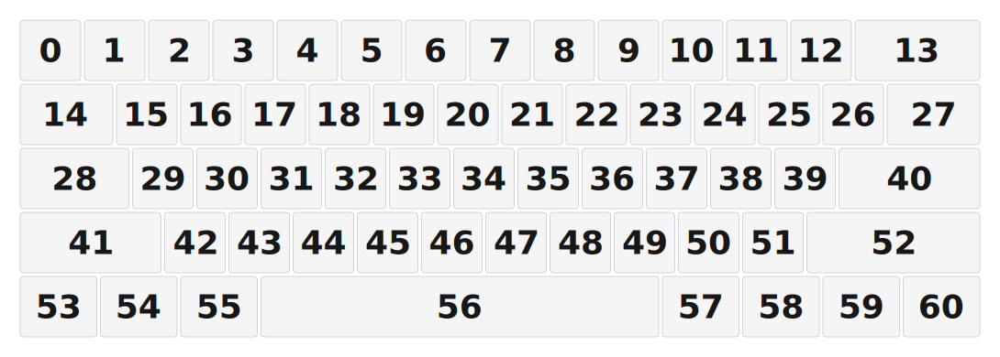

# ZMK Configuration for Touch60

*Generated by Shield Wizard for ZMK*



Download compiled firmware from the Actions tab. <https://zmk.dev/docs/user-setup#installing-the-firmware>

Edit your keymap <https://zmk.dev/docs/keymaps>.
User keymap is located at [`config/touch60.keymap`](config/touch60.keymap).

-----

<details>
<summary>
Shield Wizard Debug Information
</summary>

In case of broken configuration, here is the Shield Wizard internal data used to generate this configuration:

Commit: 8a52249f61161469b6d90ed8c80c4aa52b9f3858

```json
{"name":"Touch60","shield":"touch60","dongle":false,"modules":["petejohanson/cirque"],"layout":[{"id":"01KHDAX12WJS49J2MR5SJ0TW8B","part":0,"row":0,"col":0,"w":1,"h":1,"x":0,"y":0,"r":0,"rx":0,"ry":0},{"id":"01KHDAX12WPBKTK5EX04EKVPGS","part":0,"row":0,"col":1,"w":1,"h":1,"x":1,"y":0,"r":0,"rx":0,"ry":0},{"id":"01KHDAX12WAX8TEYNCT32XV4MG","part":0,"row":0,"col":2,"w":1,"h":1,"x":2,"y":0,"r":0,"rx":0,"ry":0},{"id":"01KHDAX12W22F7ND0G5RV9SAC9","part":0,"row":0,"col":3,"w":1,"h":1,"x":3,"y":0,"r":0,"rx":0,"ry":0},{"id":"01KHDAX12WK0FMJ29ZNHRW60FF","part":0,"row":0,"col":4,"w":1,"h":1,"x":4,"y":0,"r":0,"rx":0,"ry":0},{"id":"01KHDAX12XMQQFJH3GYJHKGTMH","part":0,"row":0,"col":5,"w":1,"h":1,"x":5,"y":0,"r":0,"rx":0,"ry":0},{"id":"01KHDAX12X1NS5WQ6PKZ49EVMW","part":0,"row":0,"col":6,"w":1,"h":1,"x":6,"y":0,"r":0,"rx":0,"ry":0},{"id":"01KHDAX12XXV9ZSX64FCC5P8MV","part":0,"row":0,"col":7,"w":1,"h":1,"x":7,"y":0,"r":0,"rx":0,"ry":0},{"id":"01KHDAX12XY17QQG4C9PDPPT9J","part":0,"row":0,"col":8,"w":1,"h":1,"x":8,"y":0,"r":0,"rx":0,"ry":0},{"id":"01KHDAX12X7VPPA6K3EH3EBX75","part":0,"row":0,"col":9,"w":1,"h":1,"x":9,"y":0,"r":0,"rx":0,"ry":0},{"id":"01KHDAX12XB323BBMFES6V0CTG","part":0,"row":0,"col":10,"w":1,"h":1,"x":10,"y":0,"r":0,"rx":0,"ry":0},{"id":"01KHDAX12X16PTQR96MET0771P","part":0,"row":0,"col":11,"w":1,"h":1,"x":11,"y":0,"r":0,"rx":0,"ry":0},{"id":"01KHDAX12X1VZ142ATD18XDFW0","part":0,"row":0,"col":12,"w":1,"h":1,"x":12,"y":0,"r":0,"rx":0,"ry":0},{"id":"01KHDAX12XT3147192GTYQ1DRA","part":0,"row":0,"col":13,"w":2,"h":1,"x":13,"y":0,"r":0,"rx":0,"ry":0},{"id":"01KHDAX12X8FCQBN2TCJAYB450","part":0,"row":1,"col":0,"w":1.5,"h":1,"x":0,"y":1,"r":0,"rx":0,"ry":0},{"id":"01KHDAX12XQRF36ZK431Q9A7XE","part":0,"row":1,"col":1,"w":1,"h":1,"x":1.5,"y":1,"r":0,"rx":0,"ry":0},{"id":"01KHDAX12X1M7X0SK7QRMKED6Q","part":0,"row":1,"col":2,"w":1,"h":1,"x":2.5,"y":1,"r":0,"rx":0,"ry":0},{"id":"01KHDAX12XBV2NETQXK3VF21AN","part":0,"row":1,"col":3,"w":1,"h":1,"x":3.5,"y":1,"r":0,"rx":0,"ry":0},{"id":"01KHDAX12XGDX7FC1PJVS5Q19T","part":0,"row":1,"col":4,"w":1,"h":1,"x":4.5,"y":1,"r":0,"rx":0,"ry":0},{"id":"01KHDAX12XG90E8ZQ9BE96WXAJ","part":0,"row":1,"col":5,"w":1,"h":1,"x":5.5,"y":1,"r":0,"rx":0,"ry":0},{"id":"01KHDAX12X6MFTJG8E8N6JPFCQ","part":0,"row":1,"col":6,"w":1,"h":1,"x":6.5,"y":1,"r":0,"rx":0,"ry":0},{"id":"01KHDAX12XRKSBN0C89PA1N29P","part":0,"row":1,"col":7,"w":1,"h":1,"x":7.5,"y":1,"r":0,"rx":0,"ry":0},{"id":"01KHDAX12XMRB7D1CFBFYWHWGB","part":0,"row":1,"col":8,"w":1,"h":1,"x":8.5,"y":1,"r":0,"rx":0,"ry":0},{"id":"01KHDAX12XB5XGG1ACE5AH0BDV","part":0,"row":1,"col":9,"w":1,"h":1,"x":9.5,"y":1,"r":0,"rx":0,"ry":0},{"id":"01KHDAX12XA9Q01NCHKZ9JZK8C","part":0,"row":1,"col":10,"w":1,"h":1,"x":10.5,"y":1,"r":0,"rx":0,"ry":0},{"id":"01KHDAX12XKK855VBJ7Z5GX429","part":0,"row":1,"col":11,"w":1,"h":1,"x":11.5,"y":1,"r":0,"rx":0,"ry":0},{"id":"01KHDAX12X3XVD05488GENGYYW","part":0,"row":1,"col":12,"w":1,"h":1,"x":12.5,"y":1,"r":0,"rx":0,"ry":0},{"id":"01KHDAX12X9H0DFJJC5P3RPKYF","part":0,"row":1,"col":13,"w":1.5,"h":1,"x":13.5,"y":1,"r":0,"rx":0,"ry":0},{"id":"01KHDAX12XCFJNM5EDC8Q0VNTX","part":0,"row":2,"col":0,"w":1.75,"h":1,"x":0,"y":2,"r":0,"rx":0,"ry":0},{"id":"01KHDAX12X3B7PDHKFVP6H4DSP","part":0,"row":2,"col":1,"w":1,"h":1,"x":1.75,"y":2,"r":0,"rx":0,"ry":0},{"id":"01KHDAX12X428N45BAAV2W15P8","part":0,"row":2,"col":2,"w":1,"h":1,"x":2.75,"y":2,"r":0,"rx":0,"ry":0},{"id":"01KHDAX12XKZ4BVMSX3AWTSKRV","part":0,"row":2,"col":3,"w":1,"h":1,"x":3.75,"y":2,"r":0,"rx":0,"ry":0},{"id":"01KHDAX12X60H0QRGEYXP91DH7","part":0,"row":2,"col":4,"w":1,"h":1,"x":4.75,"y":2,"r":0,"rx":0,"ry":0},{"id":"01KHDAX12XK4XA74N4A5QT714M","part":0,"row":2,"col":5,"w":1,"h":1,"x":5.75,"y":2,"r":0,"rx":0,"ry":0},{"id":"01KHDAX12XAYKK84PDFRFE9HJ5","part":0,"row":2,"col":6,"w":1,"h":1,"x":6.75,"y":2,"r":0,"rx":0,"ry":0},{"id":"01KHDAX12XJHA00XM285T1Y6QQ","part":0,"row":2,"col":7,"w":1,"h":1,"x":7.75,"y":2,"r":0,"rx":0,"ry":0},{"id":"01KHDAX12XW24AB0QX10XXFVRJ","part":0,"row":2,"col":8,"w":1,"h":1,"x":8.75,"y":2,"r":0,"rx":0,"ry":0},{"id":"01KHDAX12XS59W6T4NSETBQQ3M","part":0,"row":2,"col":9,"w":1,"h":1,"x":9.75,"y":2,"r":0,"rx":0,"ry":0},{"id":"01KHDAX12XQ0FJF9828WJFXGNZ","part":0,"row":2,"col":10,"w":1,"h":1,"x":10.75,"y":2,"r":0,"rx":0,"ry":0},{"id":"01KHDAX12XGX5D9ZNK01ASMNBE","part":0,"row":2,"col":11,"w":1,"h":1,"x":11.75,"y":2,"r":0,"rx":0,"ry":0},{"id":"01KHDAX12X7V6K3VBAPA8R9NK9","part":0,"row":2,"col":12,"w":2.25,"h":1,"x":12.75,"y":2,"r":0,"rx":0,"ry":0},{"id":"01KHDAX12X45XV0NJXEEX0WQG2","part":0,"row":3,"col":0,"w":2.25,"h":1,"x":0,"y":3,"r":0,"rx":0,"ry":0},{"id":"01KHDAX12X3FR32N840Q4NW5KX","part":0,"row":3,"col":2,"w":1,"h":1,"x":2.25,"y":3,"r":0,"rx":0,"ry":0},{"id":"01KHDAX12XER99ZB8SKZRXXXYX","part":0,"row":3,"col":3,"w":1,"h":1,"x":3.25,"y":3,"r":0,"rx":0,"ry":0},{"id":"01KHDAX12XTCM6TC8HYBR3NWN1","part":0,"row":3,"col":4,"w":1,"h":1,"x":4.25,"y":3,"r":0,"rx":0,"ry":0},{"id":"01KHDAX12X79WBRCVAGBVZZJYH","part":0,"row":3,"col":5,"w":1,"h":1,"x":5.25,"y":3,"r":0,"rx":0,"ry":0},{"id":"01KHDAX12XMZJFMDTRDET0B5BA","part":0,"row":3,"col":6,"w":1,"h":1,"x":6.25,"y":3,"r":0,"rx":0,"ry":0},{"id":"01KHDAX12XXS5CN87M70XNR8MS","part":0,"row":3,"col":7,"w":1,"h":1,"x":7.25,"y":3,"r":0,"rx":0,"ry":0},{"id":"01KHDAX12XM7K2EYGJ1X28SW1V","part":0,"row":3,"col":8,"w":1,"h":1,"x":8.25,"y":3,"r":0,"rx":0,"ry":0},{"id":"01KHDAX12XZR44DWER9GSB7NMP","part":0,"row":3,"col":9,"w":1,"h":1,"x":9.25,"y":3,"r":0,"rx":0,"ry":0},{"id":"01KHDAX12X6H1W9EVWR15GKS32","part":0,"row":3,"col":10,"w":1,"h":1,"x":10.25,"y":3,"r":0,"rx":0,"ry":0},{"id":"01KHDAX12X25YQ2BD6CD61NYQK","part":0,"row":3,"col":11,"w":1,"h":1,"x":11.25,"y":3,"r":0,"rx":0,"ry":0},{"id":"01KHDAX12XVTTND7CXFCTW3GWT","part":0,"row":3,"col":12,"w":2.75,"h":1,"x":12.25,"y":3,"r":0,"rx":0,"ry":0},{"id":"01KHDAX12XMKS7BFKSP5X38J89","part":0,"row":4,"col":0,"w":1.25,"h":1,"x":0,"y":4,"r":0,"rx":0,"ry":0},{"id":"01KHDAX12XAEY394VH2NSA5DW7","part":0,"row":4,"col":1,"w":1.25,"h":1,"x":1.25,"y":4,"r":0,"rx":0,"ry":0},{"id":"01KHDAX12XBPPGXG1A2ZM0X9W1","part":0,"row":4,"col":2,"w":1.25,"h":1,"x":2.5,"y":4,"r":0,"rx":0,"ry":0},{"id":"01KHDAX12XETSMKPVQXEZH13FC","part":0,"row":4,"col":6,"w":6.25,"h":1,"x":3.75,"y":4,"r":0,"rx":0,"ry":0},{"id":"01KHDAX12X57JR6ERB9QVBN41E","part":0,"row":4,"col":10,"w":1.25,"h":1,"x":10,"y":4,"r":0,"rx":0,"ry":0},{"id":"01KHDAX12X386X7QVX3CR4RG3E","part":0,"row":4,"col":11,"w":1.25,"h":1,"x":11.25,"y":4,"r":0,"rx":0,"ry":0},{"id":"01KHDAX12XZH8PVK0Y6E8JN32K","part":0,"row":4,"col":12,"w":1.25,"h":1,"x":12.5,"y":4,"r":0,"rx":0,"ry":0},{"id":"01KHDAX12XHB45RM17B6TCP1NJ","part":0,"row":4,"col":13,"w":1.25,"h":1,"x":13.75,"y":4,"r":0,"rx":0,"ry":0}],"parts":[{"name":"unibody","controller":"nice_nano_v2","wiring":"matrix_diode","pins":{"d1":"bus","d2":"bus","d3":"bus","d4":"output","d5":"output","d6":"output","d7":"output","d8":"output","d9":"output","p101":"output","p102":"input","p107":"input","d10":"input","d16":"input","d14":"input","d15":"input","d18":"input","d19":"input","d20":"input","d21":"input","d0":"bus"},"keys":{"01KHDAX12XMKS7BFKSP5X38J89":{"input":"p107","output":"d4"},"01KHDAX12X45XV0NJXEEX0WQG2":{"input":"d10","output":"d4"},"01KHDAX12XCFJNM5EDC8Q0VNTX":{"input":"d14","output":"d4"},"01KHDAX12X8FCQBN2TCJAYB450":{"input":"d18","output":"d4"},"01KHDAX12WJS49J2MR5SJ0TW8B":{"input":"d20","output":"d4"},"01KHDAX12WPBKTK5EX04EKVPGS":{"input":"d21","output":"d4"},"01KHDAX12XQRF36ZK431Q9A7XE":{"input":"d19","output":"d4"},"01KHDAX12X3FR32N840Q4NW5KX":{"input":"d16","output":"d4"},"01KHDAX12XAEY394VH2NSA5DW7":{"input":"p102","output":"d4"},"01KHDAX12WAX8TEYNCT32XV4MG":{"input":"d20","output":"d5"},"01KHDAX12W22F7ND0G5RV9SAC9":{"input":"d21","output":"d5"},"01KHDAX12X1M7X0SK7QRMKED6Q":{"input":"d18","output":"d5"},"01KHDAX12XBV2NETQXK3VF21AN":{"input":"d19","output":"d5"},"01KHDAX12X428N45BAAV2W15P8":{"input":"d14","output":"d5"},"01KHDAX12XKZ4BVMSX3AWTSKRV":{"input":"d15","output":"d5"},"01KHDAX12XER99ZB8SKZRXXXYX":{"input":"d10","output":"d5"},"01KHDAX12XTCM6TC8HYBR3NWN1":{"input":"d16","output":"d5"},"01KHDAX12XBPPGXG1A2ZM0X9W1":{"input":"p107","output":"d5"},"01KHDAX12XETSMKPVQXEZH13FC":{"input":"p102","output":"d5"},"01KHDAX12WK0FMJ29ZNHRW60FF":{"input":"d20","output":"d6"},"01KHDAX12XMQQFJH3GYJHKGTMH":{"input":"d21","output":"d6"},"01KHDAX12XGDX7FC1PJVS5Q19T":{"input":"d18","output":"d6"},"01KHDAX12XG90E8ZQ9BE96WXAJ":{"input":"d19","output":"d6"},"01KHDAX12X60H0QRGEYXP91DH7":{"input":"d14","output":"d6"},"01KHDAX12XK4XA74N4A5QT714M":{"input":"d15","output":"d6"},"01KHDAX12X79WBRCVAGBVZZJYH":{"input":"p102","output":"d6"},"01KHDAX12XMZJFMDTRDET0B5BA":{"input":"p107","output":"d6"},"01KHDAX12XXS5CN87M70XNR8MS":{"input":"d10","output":"d6"},"01KHDAX12XM7K2EYGJ1X28SW1V":{"input":"d16","output":"d6"},"01KHDAX12X1NS5WQ6PKZ49EVMW":{"input":"d20","output":"d7"},"01KHDAX12XXV9ZSX64FCC5P8MV":{"input":"d21","output":"d7"},"01KHDAX12X6MFTJG8E8N6JPFCQ":{"input":"d18","output":"d7"},"01KHDAX12XRKSBN0C89PA1N29P":{"input":"d19","output":"d7"},"01KHDAX12XAYKK84PDFRFE9HJ5":{"input":"d14","output":"d7"},"01KHDAX12XJHA00XM285T1Y6QQ":{"input":"d15","output":"d7"},"01KHDAX12XW24AB0QX10XXFVRJ":{"input":"d10","output":"d7"},"01KHDAX12XZR44DWER9GSB7NMP":{"input":"p102","output":"d7"},"01KHDAX12XS59W6T4NSETBQQ3M":{"input":"d16","output":"d7"},"01KHDAX12X6H1W9EVWR15GKS32":{"input":"p107","output":"d7"},"01KHDAX12XY17QQG4C9PDPPT9J":{"input":"d19","output":"d8"},"01KHDAX12XMRB7D1CFBFYWHWGB":{"input":"d14","output":"d8"},"01KHDAX12X7VPPA6K3EH3EBX75":{"input":"d20","output":"d8"},"01KHDAX12XB5XGG1ACE5AH0BDV":{"input":"d15","output":"d8"},"01KHDAX12XB323BBMFES6V0CTG":{"input":"d21","output":"d8"},"01KHDAX12XA9Q01NCHKZ9JZK8C":{"input":"d18","output":"d8"},"01KHDAX12XQ0FJF9828WJFXGNZ":{"input":"d10","output":"d8"},"01KHDAX12X57JR6ERB9QVBN41E":{"input":"p102","output":"d8"},"01KHDAX12X25YQ2BD6CD61NYQK":{"input":"d16","output":"d8"},"01KHDAX12X386X7QVX3CR4RG3E":{"input":"p107","output":"d8"},"01KHDAX12X16PTQR96MET0771P":{"input":"d18","output":"d9"},"01KHDAX12XKK855VBJ7Z5GX429":{"input":"d14","output":"d9"},"01KHDAX12XGX5D9ZNK01ASMNBE":{"input":"d10","output":"d9"},"01KHDAX12X1VZ142ATD18XDFW0":{"input":"d19","output":"d9"},"01KHDAX12X3XVD05488GENGYYW":{"input":"d15","output":"d9"},"01KHDAX12XT3147192GTYQ1DRA":{"input":"d20","output":"d9"},"01KHDAX12X9H0DFJJC5P3RPKYF":{"input":"d21","output":"d9"},"01KHDAX12X7V6K3VBAPA8R9NK9":{"input":"d16","output":"d9"},"01KHDAX12XVTTND7CXFCTW3GWT":{"input":"p107","output":"d9"},"01KHDAX12XZH8PVK0Y6E8JN32K":{"input":"p102","output":"d9"},"01KHDAX12XHB45RM17B6TCP1NJ":{"input":"p102","output":"p101"},"01KHDAX12X3B7PDHKFVP6H4DSP":{"input":"d15","output":"d4"}},"encoders":[],"buses":[{"name":"spi0","devices":[],"type":"spi"},{"name":"spi1","devices":[],"type":"spi"},{"name":"spi2","devices":[],"type":"spi"},{"name":"spi3","devices":[{"type":"ws2812","length":60}],"type":"spi","mosi":"d0"},{"name":"i2c0","devices":[],"type":"i2c"},{"name":"i2c1","devices":[{"dr":"d3","rotate90":false,"invertx":false,"inverty":false,"sleep":true,"noSecondaryTap":true,"noTaps":true,"sensitivity":"2x","type":"pinnacle_i2c","add":42}],"type":"i2c","sda":"d1","scl":"d2"}]}]}
```

</details>
