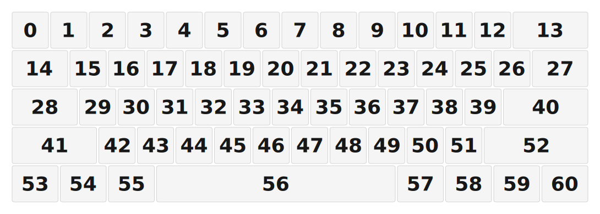

# ZMK Configuration for Touch60final

*Generated by Shield Wizard for ZMK*



Download compiled firmware from the Actions tab. <https://zmk.dev/docs/user-setup#installing-the-firmware>

Edit your keymap <https://zmk.dev/docs/keymaps>.
User keymap is located at [`config/touch60final.keymap`](config/touch60final.keymap).

-----

<details>
<summary>
Shield Wizard Debug Information
</summary>

In case of broken configuration, here is the Shield Wizard internal data used to generate this configuration:

Commit: 63ab9b7bd8845252979f45da72f40210b0b1a3ae

```json
{"name":"Touch60final","shield":"touch60final","dongle":false,"modules":["petejohanson/cirque"],"layout":[{"id":"01KVECWX7P02T2H6FHBX4W6S2Z","part":0,"row":0,"col":0,"w":1,"h":1,"x":0,"y":0,"r":0,"rx":0,"ry":0},{"id":"01KVECWX7P3FCNW0KPN5WF05P7","part":0,"row":0,"col":1,"w":1,"h":1,"x":1,"y":0,"r":0,"rx":0,"ry":0},{"id":"01KVECWX7PREBDFZ7K24P6E3N0","part":0,"row":0,"col":2,"w":1,"h":1,"x":2,"y":0,"r":0,"rx":0,"ry":0},{"id":"01KVECWX7PRSB3DNS71W8JEVS9","part":0,"row":0,"col":3,"w":1,"h":1,"x":3,"y":0,"r":0,"rx":0,"ry":0},{"id":"01KVECWX7PXN1BNJEGPSGSZDY2","part":0,"row":0,"col":4,"w":1,"h":1,"x":4,"y":0,"r":0,"rx":0,"ry":0},{"id":"01KVECWX7PKW9YSAYJN3FBQEHR","part":0,"row":0,"col":5,"w":1,"h":1,"x":5,"y":0,"r":0,"rx":0,"ry":0},{"id":"01KVECWX7QN4FZX7TBKRGJ4A69","part":0,"row":0,"col":6,"w":1,"h":1,"x":6,"y":0,"r":0,"rx":0,"ry":0},{"id":"01KVECWX7QC5Z6ZZ9KYR5C7EHG","part":0,"row":0,"col":7,"w":1,"h":1,"x":7,"y":0,"r":0,"rx":0,"ry":0},{"id":"01KVECWX7Q9CQF3RBB0ZC4D20X","part":0,"row":0,"col":8,"w":1,"h":1,"x":8,"y":0,"r":0,"rx":0,"ry":0},{"id":"01KVECWX7QMAAWMGB0CSXTCY0Y","part":0,"row":0,"col":9,"w":1,"h":1,"x":9,"y":0,"r":0,"rx":0,"ry":0},{"id":"01KVECWX7QHNCGEVXXHJYTQJMF","part":0,"row":0,"col":10,"w":1,"h":1,"x":10,"y":0,"r":0,"rx":0,"ry":0},{"id":"01KVECWX7Q9SNR1EF0GH127CW3","part":0,"row":0,"col":11,"w":1,"h":1,"x":11,"y":0,"r":0,"rx":0,"ry":0},{"id":"01KVECWX7QX69H2XAVKEKY4YRK","part":0,"row":0,"col":12,"w":1,"h":1,"x":12,"y":0,"r":0,"rx":0,"ry":0},{"id":"01KVECWX7QRRNAWKS18V95BJCT","part":0,"row":0,"col":13,"w":2,"h":1,"x":13,"y":0,"r":0,"rx":0,"ry":0},{"id":"01KVECWX7QXKMKCB4R4A2GMJD9","part":0,"row":1,"col":0,"w":1.5,"h":1,"x":0,"y":1,"r":0,"rx":0,"ry":0},{"id":"01KVECWX7QMDPF12MBBV51EDQX","part":0,"row":1,"col":1,"w":1,"h":1,"x":1.5,"y":1,"r":0,"rx":0,"ry":0},{"id":"01KVECWX7QBCYTWE1MHM1R9XGM","part":0,"row":1,"col":2,"w":1,"h":1,"x":2.5,"y":1,"r":0,"rx":0,"ry":0},{"id":"01KVECWX7QNJAQQ2XEHK95A4E6","part":0,"row":1,"col":3,"w":1,"h":1,"x":3.5,"y":1,"r":0,"rx":0,"ry":0},{"id":"01KVECWX7QBCGM2QFC2QTR8V16","part":0,"row":1,"col":4,"w":1,"h":1,"x":4.5,"y":1,"r":0,"rx":0,"ry":0},{"id":"01KVECWX7QZJ5AF21Q58S01MHE","part":0,"row":1,"col":5,"w":1,"h":1,"x":5.5,"y":1,"r":0,"rx":0,"ry":0},{"id":"01KVECWX7Q86TVWR4HC3R10T13","part":0,"row":1,"col":6,"w":1,"h":1,"x":6.5,"y":1,"r":0,"rx":0,"ry":0},{"id":"01KVECWX7QEWGFE25ZGHTXP8S1","part":0,"row":1,"col":7,"w":1,"h":1,"x":7.5,"y":1,"r":0,"rx":0,"ry":0},{"id":"01KVECWX7Q6G7VP484PGKZ1JDE","part":0,"row":1,"col":8,"w":1,"h":1,"x":8.5,"y":1,"r":0,"rx":0,"ry":0},{"id":"01KVECWX7QDCV4DTHVWEF31MR8","part":0,"row":1,"col":9,"w":1,"h":1,"x":9.5,"y":1,"r":0,"rx":0,"ry":0},{"id":"01KVECWX7QM3044BQ3DDFRBDBE","part":0,"row":1,"col":10,"w":1,"h":1,"x":10.5,"y":1,"r":0,"rx":0,"ry":0},{"id":"01KVECWX7QXG1ZCGYBAB73FNV6","part":0,"row":1,"col":11,"w":1,"h":1,"x":11.5,"y":1,"r":0,"rx":0,"ry":0},{"id":"01KVECWX7QT4B2B8PT21ME6QAD","part":0,"row":1,"col":12,"w":1,"h":1,"x":12.5,"y":1,"r":0,"rx":0,"ry":0},{"id":"01KVECWX7QMJ6PA713961PGE3V","part":0,"row":1,"col":13,"w":1.5,"h":1,"x":13.5,"y":1,"r":0,"rx":0,"ry":0},{"id":"01KVECWX7QE1WETRA4H7K8JMZJ","part":0,"row":2,"col":0,"w":1.75,"h":1,"x":0,"y":2,"r":0,"rx":0,"ry":0},{"id":"01KVECWX7Q7TC77JMKEYS69SHJ","part":0,"row":2,"col":1,"w":1,"h":1,"x":1.75,"y":2,"r":0,"rx":0,"ry":0},{"id":"01KVECWX7QK0DFACWP80PG2V1R","part":0,"row":2,"col":2,"w":1,"h":1,"x":2.75,"y":2,"r":0,"rx":0,"ry":0},{"id":"01KVECWX7QWPXQZPMFS4N6416Z","part":0,"row":2,"col":3,"w":1,"h":1,"x":3.75,"y":2,"r":0,"rx":0,"ry":0},{"id":"01KVECWX7QM5AK38Z4XMSHYKAM","part":0,"row":2,"col":4,"w":1,"h":1,"x":4.75,"y":2,"r":0,"rx":0,"ry":0},{"id":"01KVECWX7Q9JXPH80MM1KH930Y","part":0,"row":2,"col":5,"w":1,"h":1,"x":5.75,"y":2,"r":0,"rx":0,"ry":0},{"id":"01KVECWX7QSJDFE44J00ZQ8KZ5","part":0,"row":2,"col":6,"w":1,"h":1,"x":6.75,"y":2,"r":0,"rx":0,"ry":0},{"id":"01KVECWX7Q7JQJCBZBYNKC3PWX","part":0,"row":2,"col":7,"w":1,"h":1,"x":7.75,"y":2,"r":0,"rx":0,"ry":0},{"id":"01KVECWX7Q2B4W3F4YTQ562HQ2","part":0,"row":2,"col":8,"w":1,"h":1,"x":8.75,"y":2,"r":0,"rx":0,"ry":0},{"id":"01KVECWX7QC1HF50R30CV348WN","part":0,"row":2,"col":9,"w":1,"h":1,"x":9.75,"y":2,"r":0,"rx":0,"ry":0},{"id":"01KVECWX7QDRN9BSYBNWB90089","part":0,"row":2,"col":10,"w":1,"h":1,"x":10.75,"y":2,"r":0,"rx":0,"ry":0},{"id":"01KVECWX7QX3VJQDKK64YBXBMM","part":0,"row":2,"col":11,"w":1,"h":1,"x":11.75,"y":2,"r":0,"rx":0,"ry":0},{"id":"01KVECWX7QAPH57E3A6F26CVPD","part":0,"row":2,"col":12,"w":2.25,"h":1,"x":12.75,"y":2,"r":0,"rx":0,"ry":0},{"id":"01KVECWX7Q0ZRGCMR9HY1WSY8S","part":0,"row":3,"col":0,"w":2.25,"h":1,"x":0,"y":3,"r":0,"rx":0,"ry":0},{"id":"01KVECWX7Q57T5TW2GKVKFA7PY","part":0,"row":3,"col":2,"w":1,"h":1,"x":2.25,"y":3,"r":0,"rx":0,"ry":0},{"id":"01KVECWX7Q7K19XMTN3KB2GKFG","part":0,"row":3,"col":3,"w":1,"h":1,"x":3.25,"y":3,"r":0,"rx":0,"ry":0},{"id":"01KVECWX7QCJ54K7NKHR3JY0TF","part":0,"row":3,"col":4,"w":1,"h":1,"x":4.25,"y":3,"r":0,"rx":0,"ry":0},{"id":"01KVECWX7QZC3EWQYREKZ58EQT","part":0,"row":3,"col":5,"w":1,"h":1,"x":5.25,"y":3,"r":0,"rx":0,"ry":0},{"id":"01KVECWX7QMGHHP92MC904659D","part":0,"row":3,"col":6,"w":1,"h":1,"x":6.25,"y":3,"r":0,"rx":0,"ry":0},{"id":"01KVECWX7QCJFT6FRY7RWXK53G","part":0,"row":3,"col":7,"w":1,"h":1,"x":7.25,"y":3,"r":0,"rx":0,"ry":0},{"id":"01KVECWX7QC4798XQ38Q06PCHY","part":0,"row":3,"col":8,"w":1,"h":1,"x":8.25,"y":3,"r":0,"rx":0,"ry":0},{"id":"01KVECWX7QZEW58Y8RAFJ66VJY","part":0,"row":3,"col":9,"w":1,"h":1,"x":9.25,"y":3,"r":0,"rx":0,"ry":0},{"id":"01KVECWX7QQH5555H6H6H7S8SM","part":0,"row":3,"col":10,"w":1,"h":1,"x":10.25,"y":3,"r":0,"rx":0,"ry":0},{"id":"01KVECWX7QTN65TNJYHRJ6XCKC","part":0,"row":3,"col":11,"w":1,"h":1,"x":11.25,"y":3,"r":0,"rx":0,"ry":0},{"id":"01KVECWX7Q70CPBXV6H8W7KZX0","part":0,"row":3,"col":12,"w":2.75,"h":1,"x":12.25,"y":3,"r":0,"rx":0,"ry":0},{"id":"01KVECWX7QVAN5X7ZX39PSMT7H","part":0,"row":4,"col":0,"w":1.25,"h":1,"x":0,"y":4,"r":0,"rx":0,"ry":0},{"id":"01KVECWX7Q6T9R9ATB4T0AGGXP","part":0,"row":4,"col":1,"w":1.25,"h":1,"x":1.25,"y":4,"r":0,"rx":0,"ry":0},{"id":"01KVECWX7QYTH31MXVV1MVYGJD","part":0,"row":4,"col":2,"w":1.25,"h":1,"x":2.5,"y":4,"r":0,"rx":0,"ry":0},{"id":"01KVECWX7QST5FJH0X4D4JMBTC","part":0,"row":4,"col":6,"w":6.25,"h":1,"x":3.75,"y":4,"r":0,"rx":0,"ry":0},{"id":"01KVECWX7QBQF7G663G1PSC0D6","part":0,"row":4,"col":10,"w":1.25,"h":1,"x":10,"y":4,"r":0,"rx":0,"ry":0},{"id":"01KVECWX7Q2F2GQTT6BHR12R5K","part":0,"row":4,"col":11,"w":1.25,"h":1,"x":11.25,"y":4,"r":0,"rx":0,"ry":0},{"id":"01KVECWX7QD2DVE0KG89SMTR5F","part":0,"row":4,"col":12,"w":1.25,"h":1,"x":12.5,"y":4,"r":0,"rx":0,"ry":0},{"id":"01KVECWX7Q7TSF83XD267B1Q0M","part":0,"row":4,"col":13,"w":1.25,"h":1,"x":13.75,"y":4,"r":0,"rx":0,"ry":0}],"parts":[{"name":"unibody","controller":"nice_nano_v2","wiring":"matrix_diode","pins":{"d21":"input","d20":"input","d19":"input","d18":"input","d14":"input","d15":"input","d16":"input","p102":"input","d10":"input","p107":"input","d4":"output","d5":"output","d6":"output","d7":"output","d8":"output","d9":"output","p101":"output","d1":"bus","d0":"bus","d2":"bus"},"keys":{"01KVECWX7P3FCNW0KPN5WF05P7":{"input":"d21","output":"d4"},"01KVECWX7PRSB3DNS71W8JEVS9":{"input":"d21","output":"d5"},"01KVECWX7QHNCGEVXXHJYTQJMF":{"input":"d21","output":"d8"},"01KVECWX7QC5Z6ZZ9KYR5C7EHG":{"input":"d21","output":"d7"},"01KVECWX7PKW9YSAYJN3FBQEHR":{"input":"d21","output":"d6"},"01KVECWX7QMJ6PA713961PGE3V":{"input":"d21","output":"d9"},"01KVECWX7P02T2H6FHBX4W6S2Z":{"input":"d20","output":"d4"},"01KVECWX7PREBDFZ7K24P6E3N0":{"input":"d20","output":"d5"},"01KVECWX7PXN1BNJEGPSGSZDY2":{"input":"d20","output":"d6"},"01KVECWX7QN4FZX7TBKRGJ4A69":{"input":"d20","output":"d7"},"01KVECWX7QMAAWMGB0CSXTCY0Y":{"input":"d20","output":"d8"},"01KVECWX7QX69H2XAVKEKY4YRK":{"input":"d19","output":"d9"},"01KVECWX7Q9CQF3RBB0ZC4D20X":{"input":"d19","output":"d8"},"01KVECWX7QRRNAWKS18V95BJCT":{"input":"d20","output":"d9"},"01KVECWX7Q9SNR1EF0GH127CW3":{"input":"d18","output":"d9"},"01KVECWX7QM3044BQ3DDFRBDBE":{"input":"d18","output":"d8"},"01KVECWX7Q86TVWR4HC3R10T13":{"input":"d18","output":"d7"},"01KVECWX7QBCGM2QFC2QTR8V16":{"input":"d18","output":"d6"},"01KVECWX7QBCYTWE1MHM1R9XGM":{"input":"d18","output":"d5"},"01KVECWX7QXKMKCB4R4A2GMJD9":{"input":"d18","output":"d4"},"01KVECWX7QMDPF12MBBV51EDQX":{"input":"d19","output":"d4"},"01KVECWX7QNJAQQ2XEHK95A4E6":{"input":"d19","output":"d5"},"01KVECWX7QZJ5AF21Q58S01MHE":{"input":"d19","output":"d6"},"01KVECWX7QEWGFE25ZGHTXP8S1":{"input":"d19","output":"d7"},"01KVECWX7Q6G7VP484PGKZ1JDE":{"input":"d14","output":"d8"},"01KVECWX7QXG1ZCGYBAB73FNV6":{"input":"d14","output":"d9"},"01KVECWX7QDCV4DTHVWEF31MR8":{"input":"d15","output":"d8"},"01KVECWX7QT4B2B8PT21ME6QAD":{"input":"d15","output":"d9"},"01KVECWX7Q7TC77JMKEYS69SHJ":{"input":"d15","output":"d4"},"01KVECWX7QWPXQZPMFS4N6416Z":{"input":"d15","output":"d5"},"01KVECWX7Q9JXPH80MM1KH930Y":{"input":"d15","output":"d6"},"01KVECWX7Q7JQJCBZBYNKC3PWX":{"input":"d15","output":"d7"},"01KVECWX7QE1WETRA4H7K8JMZJ":{"input":"d14","output":"d4"},"01KVECWX7QK0DFACWP80PG2V1R":{"input":"d14","output":"d5"},"01KVECWX7QM5AK38Z4XMSHYKAM":{"input":"d14","output":"d6"},"01KVECWX7QSJDFE44J00ZQ8KZ5":{"input":"d14","output":"d7"},"01KVECWX7QC1HF50R30CV348WN":{"input":"d16","output":"d7"},"01KVECWX7QAPH57E3A6F26CVPD":{"input":"d16","output":"d9"},"01KVECWX7QTN65TNJYHRJ6XCKC":{"input":"d16","output":"d8"},"01KVECWX7QC4798XQ38Q06PCHY":{"input":"d16","output":"d6"},"01KVECWX7QCJFT6FRY7RWXK53G":{"input":"d10","output":"d6"},"01KVECWX7QZEW58Y8RAFJ66VJY":{"input":"p102","output":"d7"},"01KVECWX7QBQF7G663G1PSC0D6":{"input":"p102","output":"d8"},"01KVECWX7QST5FJH0X4D4JMBTC":{"input":"p102","output":"d5"},"01KVECWX7QD2DVE0KG89SMTR5F":{"input":"p102","output":"d9"},"01KVECWX7Q7TSF83XD267B1Q0M":{"input":"p102","output":"p101"},"01KVECWX7Q6T9R9ATB4T0AGGXP":{"input":"p102","output":"d4"},"01KVECWX7QZC3EWQYREKZ58EQT":{"input":"p102","output":"d6"},"01KVECWX7Q7K19XMTN3KB2GKFG":{"input":"d10","output":"d5"},"01KVECWX7Q0ZRGCMR9HY1WSY8S":{"input":"d10","output":"d4"},"01KVECWX7QDRN9BSYBNWB90089":{"input":"d10","output":"d8"},"01KVECWX7QX3VJQDKK64YBXBMM":{"input":"d10","output":"d9"},"01KVECWX7QQH5555H6H6H7S8SM":{"input":"p107","output":"d7"},"01KVECWX7Q2F2GQTT6BHR12R5K":{"input":"p107","output":"d8"},"01KVECWX7Q70CPBXV6H8W7KZX0":{"input":"p107","output":"d9"},"01KVECWX7QYTH31MXVV1MVYGJD":{"input":"p107","output":"d5"},"01KVECWX7QVAN5X7ZX39PSMT7H":{"input":"p107","output":"d4"},"01KVECWX7Q2B4W3F4YTQ562HQ2":{"input":"d10","output":"d7"},"01KVECWX7QMGHHP92MC904659D":{"input":"p107","output":"d6"},"01KVECWX7QCJ54K7NKHR3JY0TF":{"input":"d16","output":"d5"},"01KVECWX7Q57T5TW2GKVKFA7PY":{"input":"d16","output":"d4"}},"encoders":[],"buses":[{"name":"spi0","devices":[],"type":"spi"},{"name":"spi1","devices":[],"type":"spi"},{"name":"spi2","devices":[],"type":"spi"},{"name":"spi3","devices":[],"type":"spi"},{"name":"i2c0","devices":[{"dr":"d2","rotate90":false,"invertx":false,"inverty":false,"sleep":true,"noSecondaryTap":true,"noTaps":false,"sensitivity":"2x","type":"pinnacle_i2c","add":42}],"type":"i2c","sda":"d1","scl":"d0"},{"name":"i2c1","devices":[],"type":"i2c"}]}]}
```

</details>
